[](https://github.com/AlanCornejoQ/todo-app)
[](https://hub.docker.com/r/alancor/todo-api)
[](https://hub.docker.com/r/alancor/todo-frontend)


# To-Do App – Conteinerización y Orquestación (Compose · Swarm · Kubernetes KIND) - Práctica Nº1 – Arquitectura de Microservicios con Retry, Circuit Breaker y Load Balancer 

**Alumno:** Elmer Alan Cornejo Quito  
**Usuario Docker Hub:** [alancor](https://hub.docker.com/u/alancor)  
**Repositorio:** [AlanCornejoQ/todo-app](https://github.com/AlanCornejoQ/todo-app)

---

## Estructura del repositorio
```bash
todo-app/
├─ compose.yml
├─ frontend/
│ ├─ Dockerfile
│ ├─ default.conf
│ └─ index.html
├─ load-balancer/
│ ├─ Dockerfile
│ └─ nginx.conf
└─ services/
├─ tasks-service/
│ ├─ Dockerfile
│ ├─ requirements.txt
│ └─ app.py
└─ users-service/
├─ Dockerfile
├─ requirements.txt
└─ app.py
```
## Ejecución del proyecto

1. Clonar o descomprimir el repositorio.
2. Construir y levantar todos los servicios:
```bash
docker compose up -d --build
```
3. Verificar estado:
```bash
docker compose ps
```
## Pruebas de funcionamiento
### 1. Frontend y CRUD
Abrir <http://localhost:5173>  
- Crear una nueva tarea.  
- Marcarla como completada.  
- Usar **Actualizar** para refrescar la lista.  

### 2. Retry y Circuit Breaker
1. **Apagar una réplica** del servicio de tareas:
   ```bash
   docker compose stop tasks-a-1
   ```
   El sistema sigue funcionando gracias al Load Balancer.
2. **Apagar ambas réplicas:**
    ```bash
    docker compose stop tasks-a-2
    ```
    El endpoint /me/tasks responde con fallback:
    ```json
    {"fallback":true,"tasks":[],"message":"tasks no disponible"}
    ```
3. **Volver a encenderlas:**
    ```bash
    docker compose start tasks-a-1 tasks-a-2
    ```
    se restablece automáticamente.

## 1 Descripción

Aplicación **To-Do** modular con seis servicios:
| Servicio | Rol | Imagen |
|-----------|------|---------|
| `frontend` | UI Nginx (HTML + JS) | `alancor/todo-frontend:v1.1.0` |
| `api` | Backend Flask + Gunicorn | `alancor/todo-api:v1.1.0` |
| `db` | Base de datos PostgreSQL 16-alpine | `postgres:16-alpine` |
| `redis` | Cache/mensajería | `redis:7-alpine` |
| `adminer` | GUI de BD | `adminer:latest` |
| `cadvisor` | Monitoreo de contenedores (Compose) | `gcr.io/cadvisor/cadvisor:v0.49.1` |

Repositorio público de imágenes en Docker Hub (namespace **alancor**):
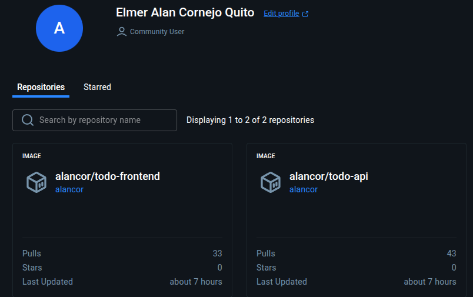

---

## 2 Arquitectura
<div align="center">  

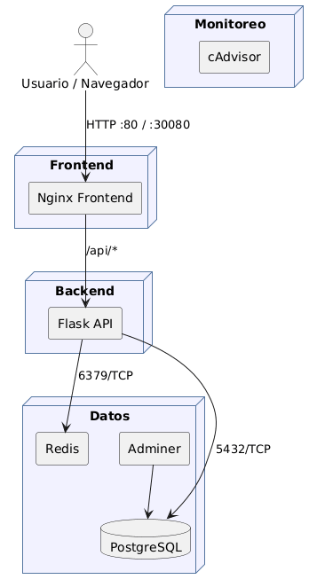  

</div>

- Red interna entre servicios (app-net)
- Variables de entorno para credenciales y conexiones
- Volumen persistente para la base de datos

---

## 3 Repositorio público de imágenes

| Imagen | Versión | Descripción |
|---------|----------|-------------|
| `alancor/todo-api:v1.0.0` | Versión inicial | CRUD de tareas básicas |
| `alancor/todo-api:v1.1.0` | Actualización | Endpoint `/` con información de versión |
| `alancor/todo-frontend:v1.0.0` | Versión inicial | Interfaz web To-Do |
| `alancor/todo-frontend:v1.1.0` | Actualización | Encabezado “To-Do v1.1.0” |

> Imágenes personalizadas construidas con Dockerfiles propios (base **Alpine**), optimizadas con `.dockerignore` y publicadas en el repositorio público **Docker Hub**.  
> Cumple los requerimientos de **conteinerización**, **versionamiento** y **repositorio público**.

---

## 4 Despliegue local – *Docker Compose*

```bash
docker compose build
docker compose up -d
docker compose ps
```
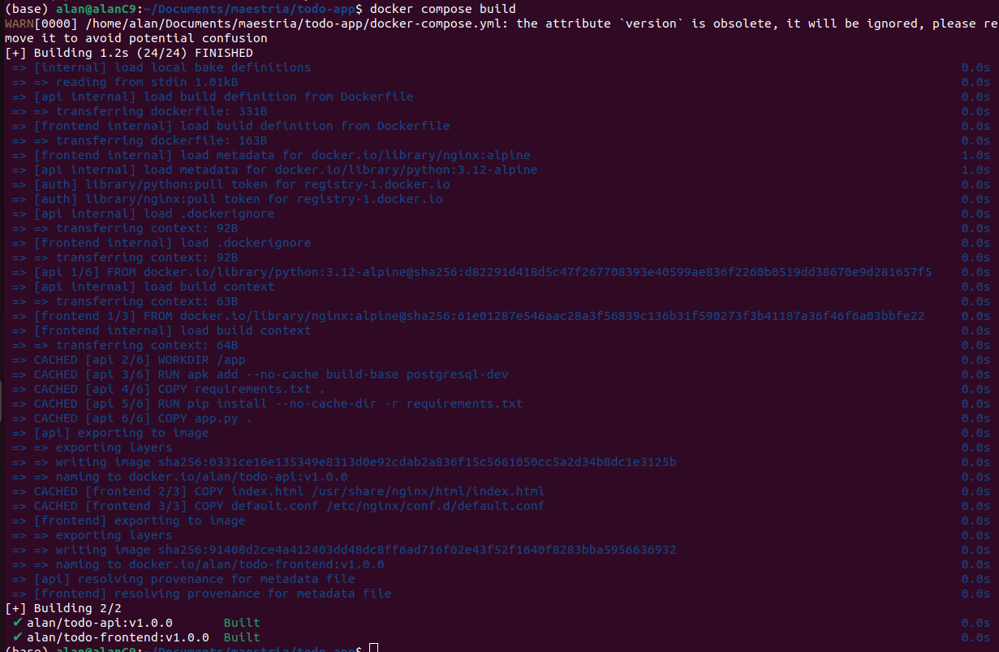
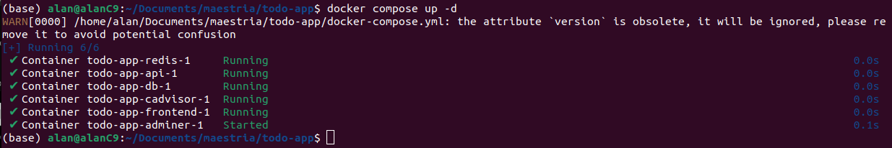
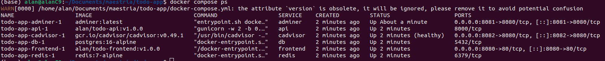
**Accesos**
- Frontend → http://localhost:8080  
- Adminer → http://localhost:8081  
- cAdvisor → http://localhost:8082  

> Se levanta toda la solución en red personalizada `app-net`, con volumen persistente `dbdata` y variables desde `.env`.

---

## 5 Despliegue en *Docker Swarm*

```bash
docker swarm init
printf "todosecret" | docker secret create db_password -
printf "production" | docker config create app_env -
docker stack deploy -c stack-deploy.yml todoapp
docker stack services todoapp
docker service ps todoapp_api
```
**Salida relevante**
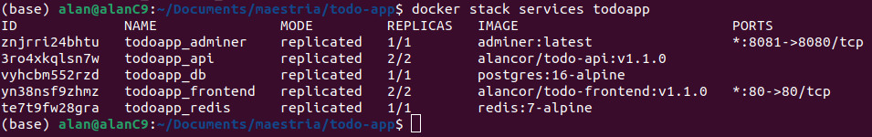
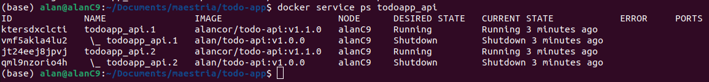


> Clúster Swarm inicializado correctamente, con **réplicas**, **overlay network**, **configs** y **secrets**.  
> Cumple el requisito de *Despliegue en Swarm con servicios replicados*.

---

## 6 Despliegue en *Kubernetes (KIND)*

### Crear clúster con puerto NodePort mapeado
```yaml
kind: Cluster
apiVersion: kind.x-k8s.io/v1alpha4
nodes:
  - role: control-plane
    extraPortMappings:
      - containerPort: 30080
        hostPort: 30080
        protocol: TCP
```

```bash
kind create cluster --name todo-cluster --config kind-config.yaml
```

### Aplicar manifiestos
```bash
kubectl apply -f k8s/namespace.yaml
kubectl -n todo apply -f k8s/secret.yaml -f k8s/configmap.yaml \
  -f k8s/db.yaml -f k8s/redis.yaml -f k8s/api.yaml -f k8s/frontend.yaml
kubectl -n todo get pods,svc,deploy -o wide
```
### Resultado observado
Pods y servicios activos en el clúster:

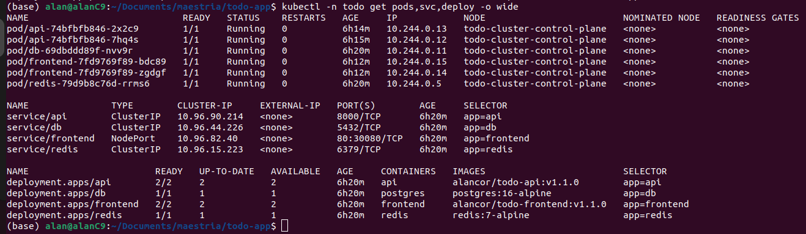

Detalle del despliegue de la API con versión actualizada:

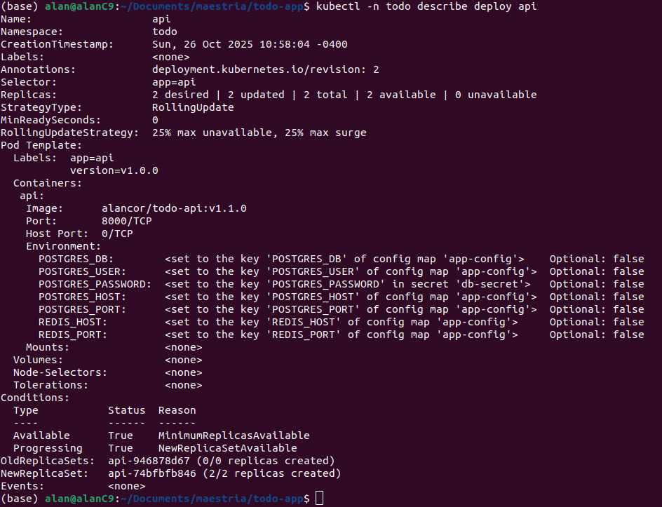

```bash
deployment.apps/api        alancor/todo-api:v1.1.0
deployment.apps/frontend   alancor/todo-frontend:v1.1.0
service/frontend NodePort 80:30080/TCP
```
**Acceso**: http://localhost:30080

### Prueba funcional
```bash
curl http://localhost:30080/api/tasks
```

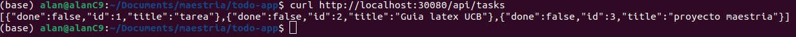

* Se verificó el correcto funcionamiento del clúster KIND y la exposición de servicios NodePort.
* Cumple Despliegue en Kubernetes (KIND).

---
## 7 Versionamiento y *Rolling Update* en K8s

###  API (Flask – Backend)

```bash
# Construcción y push de nueva versión
docker build -t alancor/todo-api:v1.1.0 api
docker push  alancor/todo-api:v1.1.0

# Actualización en el clúster (rolling update)
kubectl -n todo set image deployment/api api=alancor/todo-api:v1.1.0
kubectl -n todo rollout status deployment/api
kubectl -n todo describe deploy api | grep -i Image

```

### Evidencia
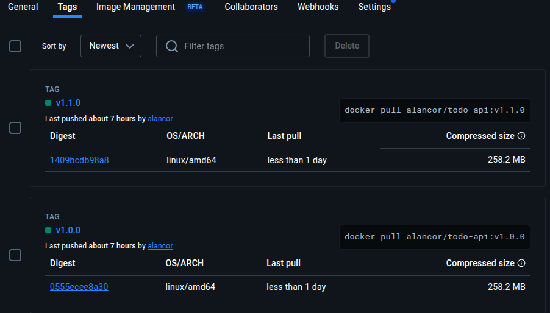
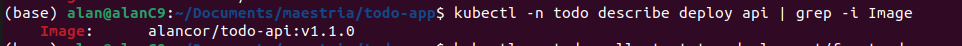
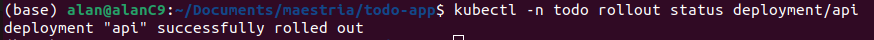
```bash
Image: alancor/todo-api:v1.1.0
```
* La API se actualizó correctamente, manteniendo disponibilidad y reflejando la nueva versión

### Frontend (Nginx – Interfaz web)
```bash
# Construcción y push de nueva versión
docker build -t alancor/todo-frontend:v1.1.0 frontend
docker push  alancor/todo-frontend:v1.1.0

# Actualización en el clúster (rolling update)
kubectl -n todo set image deployment/frontend frontend=alancor/todo-frontend:v1.1.0
kubectl -n todo rollout status deployment/frontend
kubectl -n todo describe deploy frontend | grep -i Image
```
### Evidencia
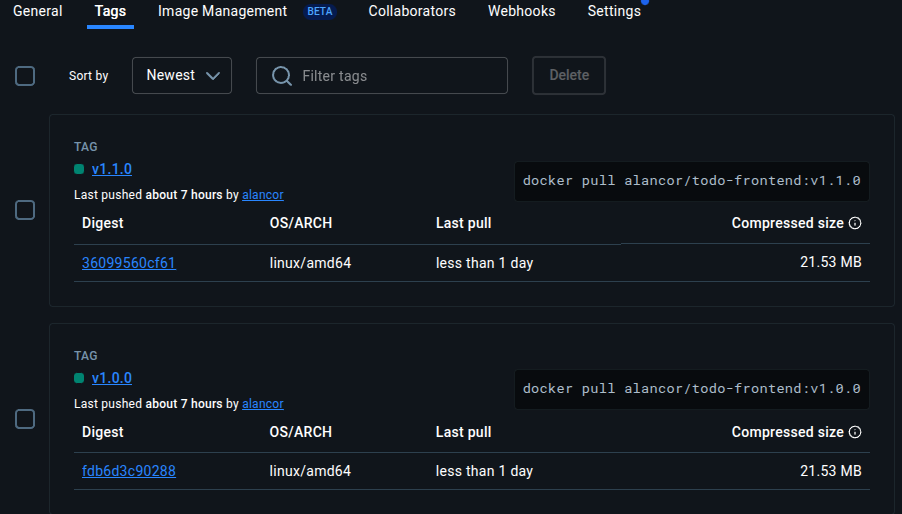
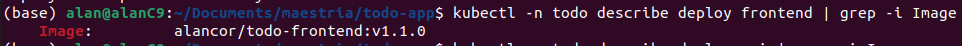
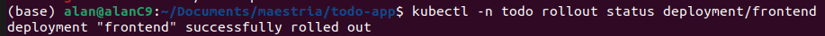
```bash
Image: alancor/todo-frontend:v1.1.0
```
* El frontend se actualizó satisfactoriamente, mostrando el encabezado “To-Do v1.1.0” en la interfaz.
* Se realizó sin interrupción del servicio, verificando la correcta aplicación del rolling update en Kubernetes.
* Cumple y supera el requisito de versionamiento mínimo de 2 versiones, aplicando la actualización controlada en dos servicios (API y Frontend) dentro del clúster KIND


| Antes (v1.0.0)* | Después (v1.1.0) |
|------------------|-----------------|
| *(Interfaz original sin indicador de versión)* | 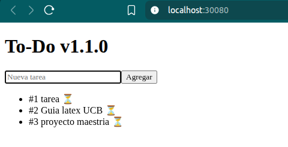 |

---

## 8 Verificación final

| Prueba | Comando / URL | Resultado |
|--------|----------------|-----------|
| Listar pods y servicios | `kubectl -n todo get pods,svc,deploy -o wide` | Todos los pods *Running* en clúster KIND |
| API funcional | `curl http://localhost:30080/api/tasks` | Devuelve JSON con las tareas registradas |
| Frontend actualizado | `http://localhost:30080` | Interfaz visible con título **“To-Do v1.1.0”** |
| Verificar imágenes desplegadas | `kubectl -n todo describe deploy api \| grep -i Image` y `kubectl -n todo describe deploy frontend \| grep -i Image` | Muestran `alancor/todo-api:v1.1.0` y `alancor/todo-frontend:v1.1.0` |
| Swarm status | `docker stack services todoapp` | Servicios replicados y en estado *Running* (`alancor/*:v1.1.0`) |

> Las pruebas confirman el funcionamiento completo de la aplicación en los tres entornos: **Compose**, **Swarm** y **Kubernetes (KIND)**.  
> Se validó la comunicación entre servicios, el correcto enrutamiento interno (frontend ↔ api ↔ db ↔ redis) y la persistencia de datos en PostgreSQL.

---

## 9 Evaluación trazada

| Criterio oficial | Evidencia en este proyecto |
|------------------|-----------------------------|
| **Arquitectura** | Seis servicios independientes: frontend, api, db, redis, adminer, cadvisor; uso de red interna y variables de entorno |
| **Conteinerización** | Dockerfiles livianos (Alpine), `.dockerignore`, sin credenciales, etiquetas versionadas (`v1.0.0` y `v1.1.0`) |
| **Compose / Swarm** | `docker-compose.yml` y `stack-deploy.yml` con réplicas, configs y secrets; validado con `docker stack services` |
| **Kubernetes** | Manifiestos YAML completos (Namespace, Secret, ConfigMap, PVC, Deployments, Services NodePort); clúster KIND funcional |
| **Documentación** | Este README con pasos reproducibles, evidencias de ejecución y capturas de verificación |

>  Se cumplen **todos los criterios de evaluación** establecidos en la guía del examen final, incluyendo versionamiento, orquestación y documentación técnica reproducible.

---

## Conclusión

El proyecto demuestra la migración completa **del desarrollo local a la orquestación en clúster**, manteniendo la misma arquitectura modular y escalable.  
Se lograron todos los objetivos específicos del examen:

- **Imágenes personalizadas y públicas** en Docker Hub (`alancor/*`)  
- **Versionamiento mínimo y rolling updates** aplicados en **API** y **Frontend**  
- **Despliegue funcional** en *Docker Compose*, *Docker Swarm* y *Kubernetes (KIND)*  
- **Documentación integral y reproducible**, evidenciando el ciclo completo de containerización y orquestación  
- **Código fuente** publicados en el repositorio público de GitHub: [AlanCornejoQ/todo-app](https://github.com/AlanCornejoQ/todo-app)
